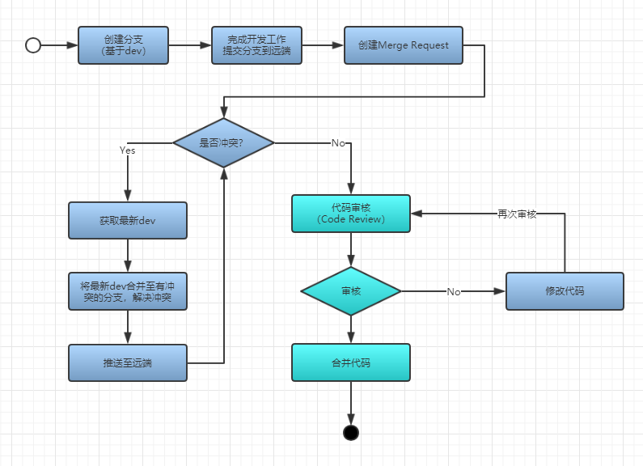
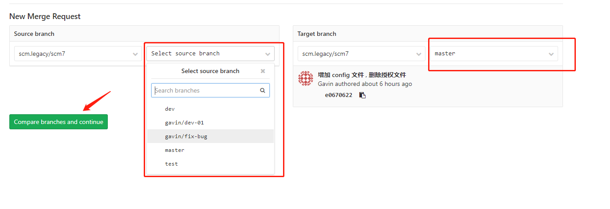
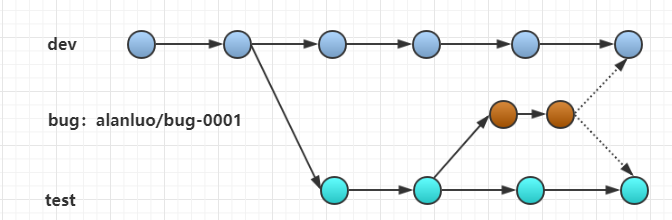

## Git workflow & 开发流程规范

#### 【Part 1】：流程概览

目前的开发流程，参照Vincent Driessen 针对 Git Flow的经典模型进行一些调整。

针对SCM 开发团队的工作流程，我们将会建立2个长期分支：

* dev：开发团队用于开发的分支。
* test：待测试版本所在分支。

> notes：长期分支会被保护，无法在本地直接推送至远端，只能通过创建Merge Request进行合并。

几个重要的时间节点：

> Code complete：功能开发完成，提交提测（dev 分支合并至test分支）

> ~~Code freeze：功能测试通过~~

> Release：回归测试结束（test分支合并至master）

日常的开发中，可能会用到以下临时分支：

* feature：用于日常功能开发。
* bug：用于dev或者test分支上的bug修改。
* hotfix：用于线上紧急发布处理（hotfix）。

#### 【Part 2】：分支命名规范

长期分支：dev , test

临时分支格式：

* feature：{用户名}/feature-{需求编号 or 功能简述}。
* bug：{用户名}/bug-{需求编号 or 功能简述}。
* hotfix：hotfix/{tagName}-{发布次数}。

ex. alanluo/feature-0000 or alanluo/feature-oms-report

> 分支名称不要包含大写字母。

> 临时分支请按照{用户名称}/XXX的形式，不要创建类似alanluo这样的分支。

#### 【Part 3】：工作流程

下图展示了基本的代码提交流程（以dev分支为例）：

Gitlab 创建Merge Request步骤：

* 提交需要合并的分支到远端仓库，如 alanluo/bug-000
* 登陆Gitlab对应仓库，点击Merge Request菜单
* 点击 New merge request 按钮

* 选择源分支和目标分支，点击比较按钮

* 修改标题 ， 审核人等信息，点击提交即可。

#### 【Part 4】：日常工作场景：

【场景一】：feature - 功能开发

1. 基于dev分支创建feature分支。
2. 开发完成提交到远端feature分支，创建merge request（合并至dev）。
3. Code Review 合并代码到dev分支（在Gitlab上完成）。

【场景二】：bug - 提测后的bug修改

1. 基于最新test分支创建bug分支。
2. 开发完成提交到远端bug分支，创建两个merge request（合并至test & 合并至dev）。
3. Code Review 合并代码到test分支和dev分支（在Gitlab上完成）。

【场景三】：hotfix - 线上紧急发布

1. 基于最新tag创建分支（或对应线上版本根据情况而定）创建hotfix分支。ex. hotfix/{tagName}-1
2. 开发完成提交到远端hotfix分支，创建两个merge request（合并至test & 合并至dev）。
3. Code Review 合并代码到test分支和dev分支（在Gitlab上完成）

> notes: 此流程发布到产品的分支是hotfix分支，hotfix需要保留请不要删除。

【场景四】：feature - 结对编程或者多人开发同一个功能

1. 基于dev分支创建feature分支，再基于feature分支创建各自分支或直接再feature分支开发。
2. 开发完成提交到远端feature分支，创建merge request（合并至dev）。
3. Code Review 合并代码到dev分支（在Gitlab上完成）

#### 更多..

关于Git的详细资料，可以参考 https://git-scm.com/book/zh/v2

Git Flow的最佳实践： https://nvie.com/posts/a-successful-git-branching-model/

阮一峰的Git Flow总结： http://www.ruanyifeng.com/blog/2015/12/git-workflow.html
