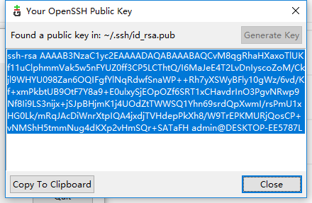

## Git安装以及开发环境搭建


#### 【Step 1】：安装Git相关工具

> Git官网地址：https://git-scm.com/ （必须安装）

> Source Tree官网：https://www.sourcetreeapp.com/

> TortoiseGit官网：https://tortoisegit.org/

以上工具你可以在FTP目录下获取：\\\\192.168.100.100\软件\测试工具\Git

notes：安装Source Tree的过程中会遇到需要账号的问题，请参阅以下文章解决 https://www.jianshu.com/p/c0accdfbd90c


#### 【Step 2】：生成并配置SSH Key

1.GUI 生成方式：启动Git GUI，点击下图中的菜单：


点击生成按钮（注意不要输入密码），此步骤会在你本地磁盘生成公钥和私钥（保存好公钥）。

> 如果你是一只崇尚命令程序猿也可以使用 $ ssh-keygen 创建SSH Key。

> 可以参考：https://blog.csdn.net/qq_25867649/article/details/73163510



2.在Gitlab上配置SSH Key：

登录公司内部的Gitlab系统： http://192.168.100.155。

点击右上角用户头像 -> Settings -> SSH Keys。


粘贴之前生成的公钥，点击保存。

3.测试公钥是否配置正确。

打开Git 命令行工具，键入以下命令，配置无误你将会收到一个简单的欢迎信息。

```code
> ssh -T git@192.168.100.155
```


#### 【Step 3】：配置Source Tree工具

> notes: 如果你是一个狂热的命令行爱好者，可以跳过这个步骤。


打开功能选项卡（Tools -> Options）


* 启动SourceTree输入全名和地址。
* 修改"SSH Client" 为 "OpenSSH"

选择对比选项卡（Options -> Diff），比较和合并工具选择TortoiseMerge


#### 【Step 4】：scm7 代码下载

登陆Gitlab，进入仓库组： Group -> scm.legacy ，你可以看到如下几个仓库


* scm7: WMS,TMS 相关代码
* scm7.document: scm 相关文档
* framework: 框架代码

点击scm7，下拉菜单选择SSH的链接方式并复制链接。


打开Source Tree，点击Clone选项 -> 复制SSH链接 ->选择代码存放目录


下载完成，如图所示。（40秒左右，你可以去倒杯水或者喝个冰封 ~ _ ~）


### 更多...

关于Git的详细资料，可以参考 https://git-scm.com/book/zh/v2

Git Flow的最佳实践： https://nvie.com/posts/a-successful-git-branching-model/

阮一峰的Git Flow总结： http://www.ruanyifeng.com/blog/2015/12/git-workflow.html

SourceTree 教程：https://jingyan.baidu.com/article/64d05a021f37a6de55f73b8d.html?tdsourcetag=s_pctim_aiomsg&qq-pf-to=pcqq.temporaryc2c
